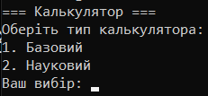
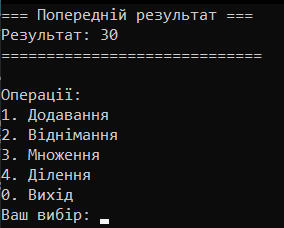
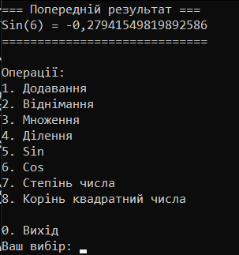

# CSharp-Homework
First homework on C# Pro.
Треба було створити програму, котра могла б працювати як калькулятор, і добавити один з режимів(в цьому випадку - науковий режим).

## Інструкція до запуску:
>dotnet build

>dotnet run --project ./CalculatorConsoleApp

## Функціонал
Можливість вибирати режим на початку, між
- Базовим калькулятором:
    - Додавання
    - Віднімання
    - Множення
    - Ділення
- Науковим(Розширений базовий калькулятор):
    - Синус(З радіан)
    - Косинус(З радіан)
    - Возводення до степення
    - Квадратний корінь

Також в програмі реалізований зручна консольна меню.
## Фото
### Вибір режиму калькулятора:

### Вигляд базового калькулятора :

### Вигляд наукового калькулятора:
